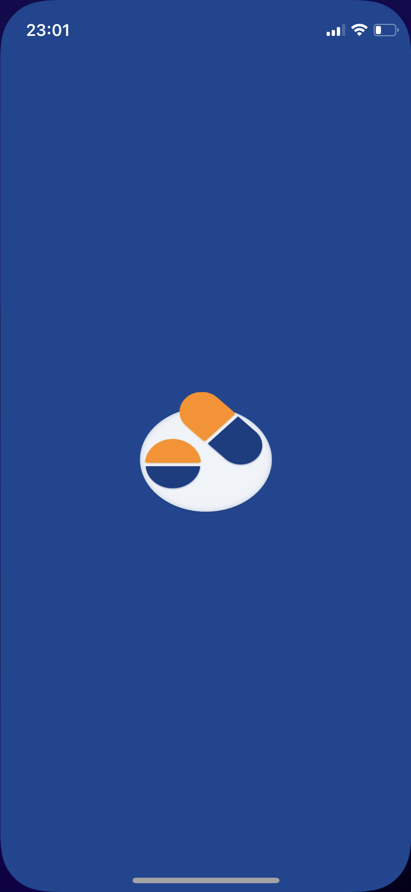
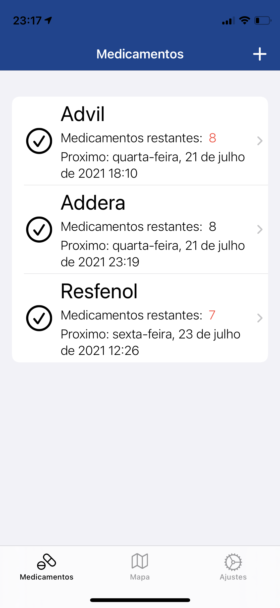
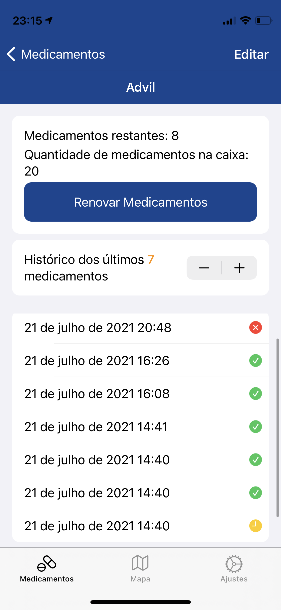
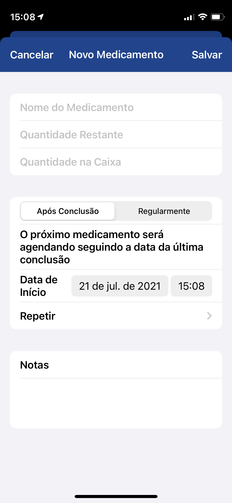
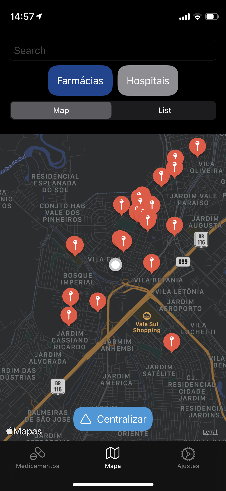
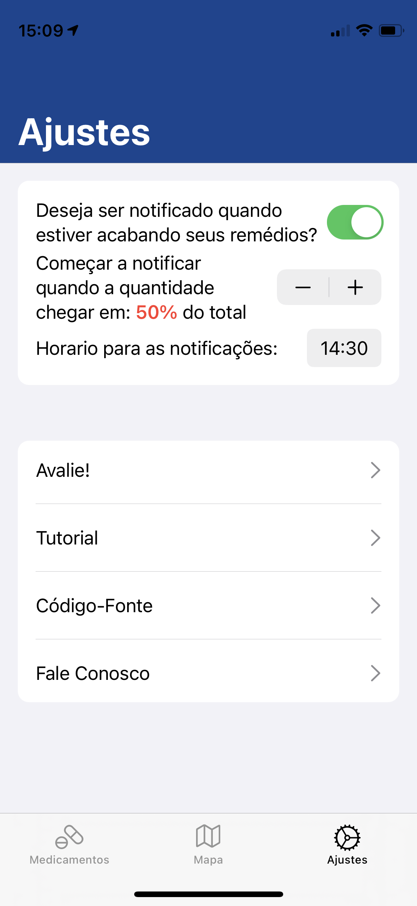

## MedControl - Controle de Medicamentos

MedControl tem como objetivo ajudar pessoas a controlar seus medicamentos, por meio dele o usuário consegue receber notificações, alertas se o medicamento estiver acabando e é preciso comprar mais e visualizar um mapa com todas as farmácias próximas da sua localização.

### Interface

      

## Funcionalidades existentes

* Lista mostrando todos os medicamentos cadastrados
* Notificações com opção de repetição
* Mapa mostrando farmácias próximas da localização
* Controle de quantidade de medicamentos 
* Notificação de quando o medicamento estiver acabando
* Histórico de medicamentos

## Suporte

### Para sugestões, problemas ou perguntas

### Contato: fabiolfp@gmail.com

